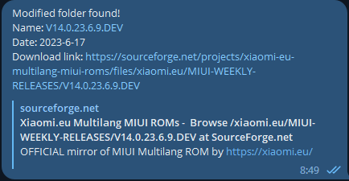

# xiaomi.eu-weekly-roms-checker
It simply checks for new folders in the cloud and returns a link to the newest folder(or last modified, because it mainly depends of the date of modification)
If you have needed data you can send the result directly to your telegram account.
Otherwise just use the file sourceforge_new_folder_checker.py to have the result in the console

