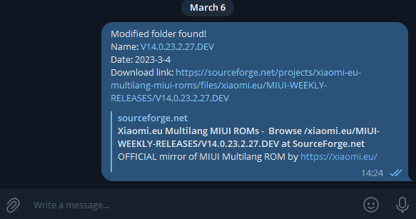
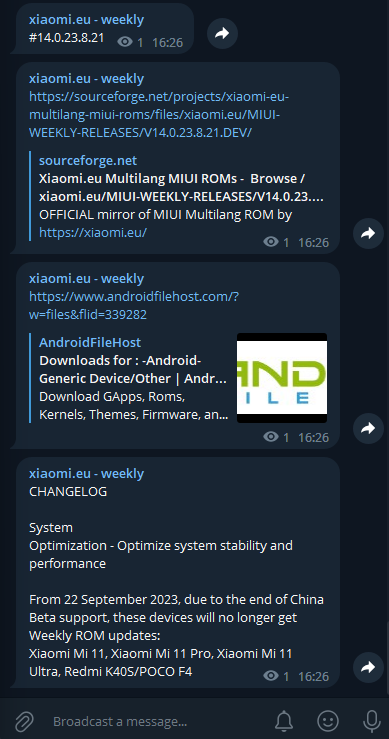

# xiaomi.eu-roms-checker

A small tool for monitoring new **xiaomi.eu ROM releases** from SourceForge.  
Originally designed for Weekly ROMs, now updated to work with the new **Stable / HyperOS** structure.

---

## ✨ Features

### **1. SourceForge Folder Scanner**
Automatically crawls the xiaomi.eu SourceForge project and:
- discovers all device folders (with recursive folder parsing)
- detects newly added folders or versions
- returns the **newest** or **last modified** ROM folder  
- prints or sends the result

### **2. Thread & Changelog Fetching (deprecated for Weekly)**
Previously supported checking the newest thread from the *xiaomi.eu Weekly section*.  
This function remains available but Weekly ROMs are no longer released.

### **3. Telegram Notifications**
Send results directly to:
- your **Telegram account**, or
- your **Telegram channel**

Fully optional—if not configured, results print to console.
You need TOKEN from https://t.me/Botfather and CHANNEL_NAME.
(see the env_sample file)

---

## 🆕 New Functionality
The tool now includes:
- **Recursive scraping** of SourceForge folders  
- **Extraction of device-specific ROM files**  
- Parsing and caching to minimize requests  
- Compatibility with the new **Stable / HyperOS** folder layout  
- Future support for table-based device lists (from image/JSON sources)

---

## 📁 Files

- `sourceforge_new_folder_checker.py`  
  Finds the newest available ROM folder (or last modified) from the xiaomi.eu SourceForge tree.

- `xiaomi_eu_new_thread_checker.py`  
  Checks the last stable thread from the xiaomi.eu forum and prepares telegram message with the title, downloads link and changelog.
  Now, because of the deprecation of weekly roms this function is no longer usable.

- `get_all_folders.py` *(new)*  
  Recursively scans all device folders and builds a full ROM index.

- `telegram_sender.py` *(optional)*  
  Send messages to Telegram (user or channel).

- read_image.py  
  A small script for extracting Market Name, Rom Name and Code Name from ROM images.

- check_json.py
  Just checks if the json files work correctly. It will be used in the  Django project.
---

## 🖼 Screenshots

SourceForge check result:


xiaomi.eu thread parsing (legacy Weekly mode):


---

## ▶️ Usage

Run folder checker:
```bash
python sourceforge_new_folder_checker.py
```

Send telegram message:
```bash
python send_to_telegram_channel.py
```